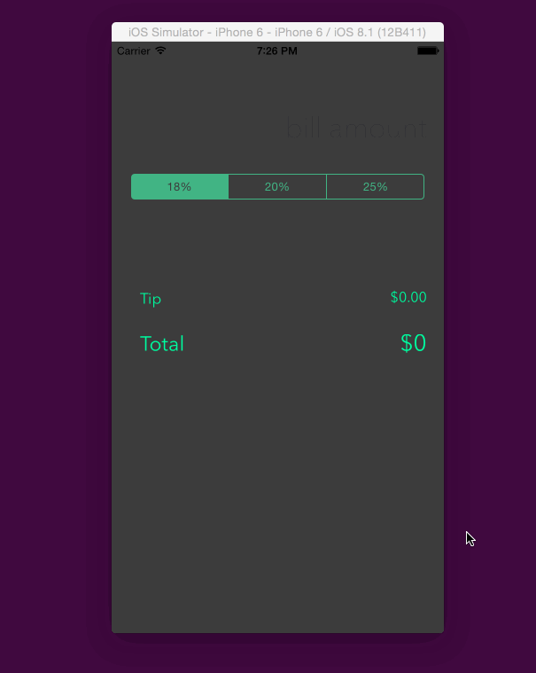

# tipety
codepath application

this is my application for Codepath. 

Time spent: maybe 2 hours spent in total, including the time it took to watch the tutorial video

Completed user stories:
I'm not sure what these stories you are refering to are..?
 
 
Notes:
How can I make the keyboard, or input field to be active, from the start of the app? (would be nice not having to tap to begin but just start typing)

Walkthrough:

GIF created with [LiceCap](http://www.cockos.com/licecap/).
